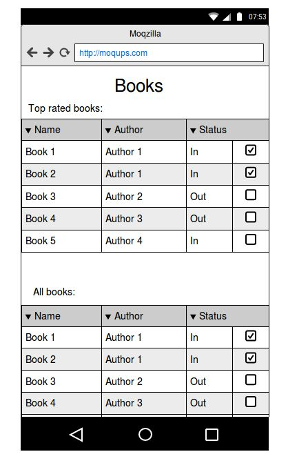
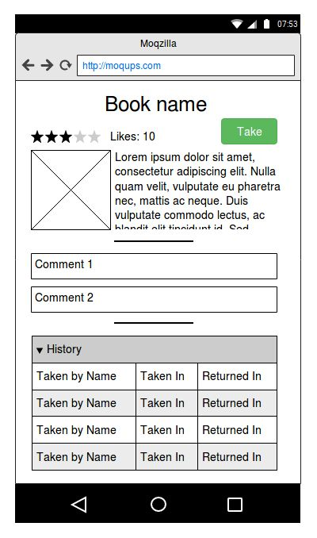

# Library exercise

Test exercise for Rails developers.
First of all - this is test task whose purpose is to check the level of candidate knowledge and process of thinking.
So dont be upset if you have not finished it. Commit and push regularly so i can see how do think. This is important! Do not push the whole app in the one commit.
Be creative, some details are missing. The way as you deal with them will also be a score for your final result.

So, image you have an own library and you want a site to see what books do you have, how many is taken, status, history etc.

Follow current technology stack:
Ruby 2.4, Rails 5+, Mysql/PostreSQL/MongoDB(mongo is encouraged), Bootstrap, Rspec.
  Pages should not be 'responsive', just make them nice view on mobile devices.
# What should you do
1. Books page. The list with all books 20 per page. Shows basic info:

    * Image
    * Book name - this is a link to book /show page.
    * Author
    * Status (status can be in/out). If status is out then display user name who took a book.
    * Edit, delete and create new book.
    Top 5 books based on likes count and taken count. Top books are displayed regardless of pagination.
1. Book page. Verbose information about a book.

    * Image
    * Name
    * Description
    * Likes counter
    * Author
    * Status
    * Comments
    * History    
    
    History includes: name of user who took a book, when book has been taked, when returned back.    
    User allowed to comment, edit, delete, like, take or return a book.

1. Book form. Nothing to say more here.

# What we are expect
We are expect as much functionality as you can do with established time for you. **Do not try to cheat and spent more time.** Quality of code/work is more important then quantity of work done. 
#### Will be a huge plus but not necessary:
* Test coverage with rspec.
* Respond with json. Serializes are encouraged.
* Bootstrap components like modal windows, panels etc. including mobile and desktop grid.
* Delete, take, return, like book without page reloading.
* Book rating (any formula)
